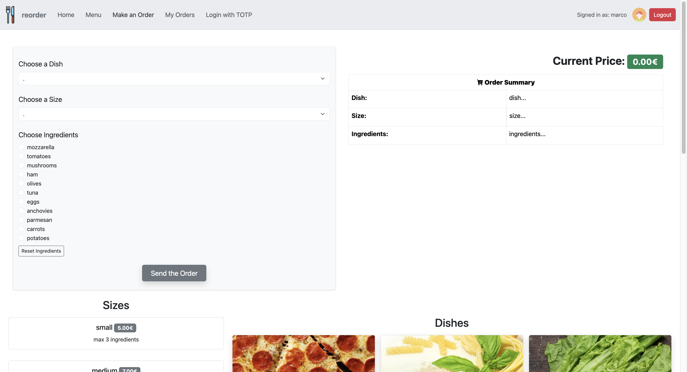

# `reorder`


A full-stack restaurant ordering system with 2FA-secured operations, built using React, Node.js and Express.

## React Client Application Routes

- Route `/`: homepage, main entry point for the webapp
- Route `/menu`:
  - Content: Available dishes, sizes, ingredients, incompatibilities, and dependencies
  - Purpose: Allow users to explore the restaurant’s offerings
  - Access: any user
- Route `/configurator`:
  - Content: Like `/menu` but with interactive options to create and customize an order
  - Purpose: Build and submit a personalized order based on the restaurant’s offerings
  - Access: Restricted to authenticated users
- Route `/login`: A simple login page for user authentication
- Route `/login-totp`: A simple login page for user authentication with TOTP
  - Access: Restricted to authenticated users
- Route `/my-orders`:
  - Content: List of orders placed by the authenticated user, including details
  - Users authenticated with TOTP can additionally cancel orders already confirmed by the restaurant
  - Purpose: Allow authenticated users to view orders confirmed by the restaurant
  - Access: Restricted to authenticated users

## Main React Components

- `MessageModal`: Modal component designed to display informative messages (e.g., errors, warnings, success), with optional logic to execute after closure (onAfterClose). Supports multiline messages via \n splitting.
- `LoginComponent`: Handles user authentication, refers to a form.
- `TotpComponent`: Handles user authentication with TOTP, refers to a form.
- `MenuPage`: Displays the menu. If seeOrderForm is true and the user is logged in, it also shows the order configurator.
- `ConfigureOrder`: manages the state and the UI for creating a customized food order.
- `OrderList`: Displays the logged-in user’s past orders and optionally allows deletion if the user has authenticated with 2FA.

## Menu View


## Order Configurator View


## Order List View

**With delete functionality**

## Users Credentials
The password is "pwd" for each authenticated user.
1. (Marco):
   - mail: u1@p.it
   - hashed-pwd: 61f930e26fc33f14d87a86efa26aa613d601e9681e9de5a31c6e9a83f4dd367a
   - salt: AAAAAAAAAAAAAAAA
   - secret (2FA): LXBSMDTMSP2I5XFXIYRGFVWSFI

2. (Filippo):
   - mail: u2@p.it
   - hashed-pwd: 61f930e26fc33f14d87a86efa26aa613d601e9681e9de5a31c6e9a83f4dd367a
   - salt: AAAAAAAAAAAAAAAA
   - secret (2FA): LXBSMDTMSP2I5XFXIYRGFVWSFI

3. (Giangiacomo):
   - mail: u3@p.it
   - hashed-pwd: 61f930e26fc33f14d87a86efa26aa613d601e9681e9de5a31c6e9a83f4dd367a
   - salt: AAAAAAAAAAAAAAAA
   - secret (2FA): ""

4. (Armando):
   - mail: u4@p.it
   - hashed-pwd: 61f930e26fc33f14d87a86efa26aa613d601e9681e9de5a31c6e9a83f4dd367a
   - salt: AAAAAAAAAAAAAAAA
   - secret (2FA): ""


## API Server
- GET `/api/menu`
    - Returns a list of available ingredients, dishes, sizes, incompatibilities and dependencies
    - Status Codes: 200, 500
    - Access: Public
- GET `/api/users/:userId/orders`
    - Path Param: userId (positive integer)
    - Response: JSON array of orders
    - Status Codes: 200, 422 (validation errors), 500
    - Access: Authenticated users
- POST `/api/orders`
    - Create a new order with a dish, size, and (optional) ingredients
    - Response: JSON object with created orderId and a message
    - Status Codes: 201, 422, 400/500
    - Access: Authenticated users
    - Request Body (the order to insert):
    - Request-body:
      ``` json
      {
        "dish_name":"pasta",
        "size_name":"small",
        "ingredients":
        [
          {"ingredient_name":"tomatoes"},
          {"ingredient_name":"olives"}
        ]
      }
      ```
    - Response-body:
      ``` json
      {
        "orderId": 30,
        "message": "Order validated and created successfully"
      }
      ```
- DELETE `/api/orders/:orderId`
    - Path Param: orderId (positive integer)
    - Remove the order from the database given the id
    - Side effect: Increment stock availability for the ingredients used in the deleted order
    - Response: JSON object with deleted orderId and a message
    - Status Codes: 201, 422, 400/500
    - Access: Authenticated users with TOTP (second-factor) authentication.
    - Response-body:
      ``` json
      {
        "orderId": 30,
        "message": "Order deleted successfully"
      }
      ```
- GET `/api/login-local/current`:
    - Get authenticated user info
    - Status Codes: 200
    - Access: Any user
    - Response-body:
      ``` json
      {
        "id":1,
        "name":"marco",
        "canDoTotp":true,
        "isTotp":false
      }
      ```

- POST `/api/login-local`:
    - Authenticate user with username and password
    - Status Codes: 200, 401
    - Access: Any user
    - Request-body:
      ``` json
      {
        "username":"u1@p.it",
        "password":"pwd"
      }
      ```
    - Response-body:
      ``` json
      {
        "name":"marco",
      }
      ```

- DELETE `/api/login-local/current`:
    - Log out the user
    - Status Codes: 200
    - Response-body:
      ``` json
      {
        "message":"Logged out",
      }
      ```

- POST `/api/login-totp`:
    - Authenticate user with TOTP code
    - Status Codes: 200
    - Access: Authenticated users
    - Request-body:
      ``` json
      {
        "code": "229921"
      }
      ```
    - Response-body:
      ``` json
      {
        "message":"TOTP verified successfully"
      }
      ```

## Database Tables

- Table `users` - contains user accounts with unique username, unique email, hashed password, salt, and optional secret.
- Table `dishes` - contains dishes available, each with unique name and optional description.
- Table `sizes` - contains portion sizes with name, price, and maximum allowed ingredients.
- Table `ingredients` - contains ingredients with a unique name, price, stock quantity, and a column indicating whether the ingredient has unlimited availability.
- Table `orders` - contains user orders referencing user, dish, size, timestamp, and total price.
- Table `ingredient_lines` - contains the many-to-many relation between orders and ingredients.
- Table `ingredient_dependencies` - contains dependency relations between ingredients (ingredient A requires ingredient B).
- Table `ingredient_incompatibilities` - contains incompatibility relations between ingredients (ingredient A incompatible with ingredient B).
